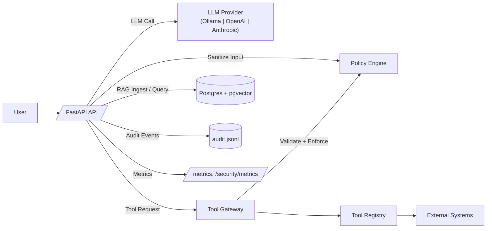

# AISecOps Lab (Reference Implementation v1)

Reference implementation of an AISecOps-oriented API with:
- Tool containment (`/tools/execute` + policy enforcement)
- Secure RAG ingestion/retrieval (`pgvector` + sanitization)
- Output validation (citations + forbidden substrings)
- Audit logging and replay workflows
- Security-focused test gates in CI
- Prometheus-compatible telemetry

## Architecture Overview



## Quickstart

### 1) Configure env
```bash
cp .env.example .env
```

Recommended for secure mode:
```bash
AISECOPS_MODE=secure
TOOL_GATEWAY_ENFORCE=true
EMBED_DIM=768
```

### 2) Start stack
```bash
docker compose up --build
```

API base URL: `http://localhost:8000`

### 3) Smoke test
```bash
curl -s http://localhost:8000/health | jq
```

## Core Endpoints

- `GET /health`: runtime/provider/mode snapshot
- `POST /chat`: direct LLM chat
- `POST /chat_rag`: secure RAG chat with citations and output validation
- `POST /rag/ingest`: ingest source text into `documents/chunks`
- `POST /rag/query`: vector retrieval with sanitization of poisoned lines
- `POST /tools/execute`: tool gateway execution with policy checks

Example RAG flow:
```bash
curl -s http://localhost:8000/rag/ingest \
  -H "Content-Type: application/json" \
  -d '{"tenant_id":"default","content":"AISecOps secures AI systems."}' | jq

curl -s http://localhost:8000/chat_rag \
  -H "Content-Type: application/json" \
  -d '{"tenant_id":"default","message":"What is AISecOps? Add citations.","top_k":5}' | jq
```

## Security Investigation Endpoints

- `GET /security/metrics`: aggregated audit metrics
- `GET /security/events/recent`: newest audit events with filters
- `GET /security/events/by-request/{rid}`: audit chain by request id
- `POST /security/replay`: replay prior request context (requires `message` to execute replay)

Request correlation:
- Send `X-Request-Id` header to propagate a caller request id.
- API also returns `X-Request-Id` on responses.

## Observability

- `GET /metrics` exposes Prometheus text format metrics.
- `config/prometheus.yml` includes a scrape target for `api:8000`.
- Audit log path defaults to `/app/audit/audit.jsonl` (mounted from `./audit`).

## Configuration

Important environment variables:
- `LLM_PROVIDER`: `ollama` (default) | `openai` | `anthropic`
- `OLLAMA_BASE_URL`
- `OLLAMA_CHAT_MODEL`
- `OLLAMA_EMBED_MODEL`
- `OPENAI_API_KEY`, `OPENAI_MODEL`
- `ANTHROPIC_API_KEY`, `ANTHROPIC_MODEL`
- `AISECOPS_MODE`: `insecure` or `secure`
- `TOOL_GATEWAY_ENFORCE`: `true` or `false`
- `DATABASE_URL`
- `EMBED_DIM` (must match vector dimension assumptions)
- `POLICY_PATH`
- `AUDIT_LOG_PATH`

Policy file: `config/policy.yaml`
- Tool allowlist and parameter validation
- SSRF deny regex for `http_get`
- RAG retrieval deny patterns
- Output citation/forbidden substring controls

## Providers

### Ollama
- Run `ollama serve` on host
- Example `OLLAMA_BASE_URL=http://host.docker.internal:11434`
- Example `OLLAMA_CHAT_MODEL=qwen3:8b`
- Example `OLLAMA_EMBED_MODEL=nomic-embed-text:latest`

### OpenAI
- Set `OPENAI_API_KEY`
- Optionally override `OPENAI_MODEL` (default `gpt-4o-mini`)

### Anthropic
- Set `ANTHROPIC_API_KEY`
- Optionally override `ANTHROPIC_MODEL` (default `claude-3-5-sonnet-latest`)

## Tests and CI

- Unit/security tests (no integration): `apps/api/tests/security`, marker `not integration`
- Integration tests (Docker, self-hosted runner): marker `integration`
- CI workflow: `.github/workflows/ci.yml`
